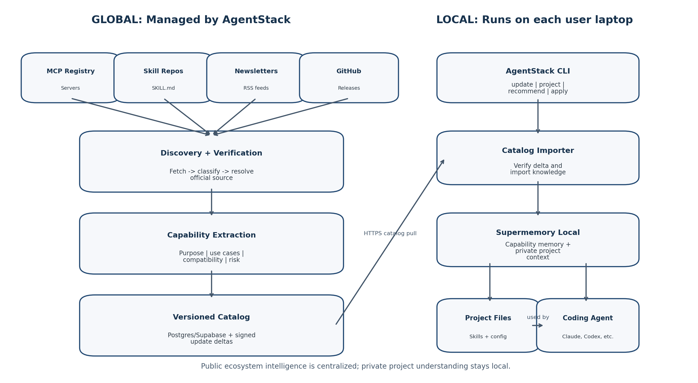
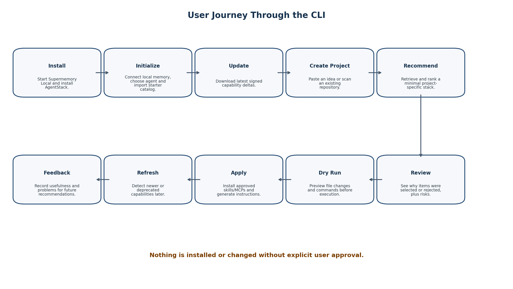
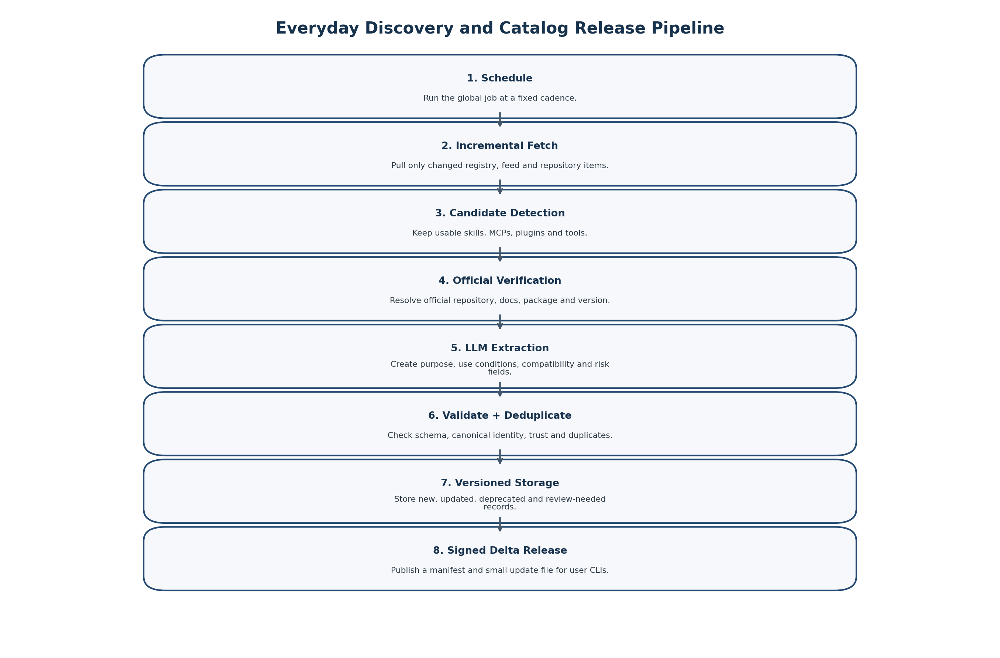

# AgentStack Radar

*A continuously updated, project-aware capability curator for AI coding agents*

**Document scope:** Product idea, complete feature set, user journey, system architecture, and everyday discovery pipeline



**Working CLI command: agentstack**

Designed around Supermemory Local for private project memory and semantic capability retrieval

## Contents

1. [Executive summary](#1-executive-summary)
2. [The problem](#2-the-problem)
3. [Product idea and core promise](#3-product-idea-and-core-promise)
4. [Product principles](#4-product-principles)
5. [Complete feature set](#5-complete-feature-set)
6. [End-to-end user experience](#6-end-to-end-user-experience)
7. [Generated project output](#7-generated-project-output)
8. [Product architecture](#8-product-architecture)
9. [Data and memory architecture](#9-data-and-memory-architecture)
10. [Everyday discovery pipeline](#10-everyday-discovery-pipeline)
11. [User catalog update flow](#11-user-catalog-update-flow)
12. [Built-in skills and starter knowledge](#12-built-in-skills-and-starter-knowledge)
13. [LLM and credential model](#13-llm-and-credential-model)
14. [Safety, trust and installation controls](#14-safety-trust-and-installation-controls)
15. [CLI command surface](#15-cli-command-surface)
16. [Hackathon MVP](#16-hackathon-mvp)
17. [Future roadmap](#17-future-roadmap)
18. [Success criteria](#18-success-criteria)
19. [Appendix A: Complete example](#appendix-a-complete-example)

## 1. Executive summary

> **Core idea**
>
> AgentStack Radar maintains a living catalog of Agent Skills, MCP servers, coding-agent plugins and development tools. A global daily pipeline discovers and understands new capabilities once, while each user keeps project details, preferences and feedback inside Supermemory Local. The CLI matches the latest catalog to a project, explains the recommended stack, and installs only what the user approves.

The product solves two problems together: **keeping up with the rapidly changing AI-agent ecosystem** and **knowing which capabilities are actually useful for a specific project.**

- **Global intelligence:** One centrally managed pipeline monitors trusted sources, verifies discoveries, and publishes versioned catalog updates.

- **Local personalization:** Supermemory Local stores the user's project context, installed stack, decisions and feedback.

- **Explainable selection:** The CLI recommends a small, compatible set rather than dumping a large marketplace list.

- **Safe application:** Nothing executable is installed and no project file is changed until the user reviews and approves a dry run.

- **Continuous learning:** User feedback changes future recommendations for that user without exposing private project context.

## 2. The problem

The AI development ecosystem changes every day. New MCP servers, Agent Skills, coding-agent plugins, CLIs, frameworks and workflows appear across registries, GitHub repositories, release notes and newsletters. A developer cannot realistically discover, evaluate and configure all of them while also building a product.

Existing registries can help a developer find items, but they do not fully answer project-specific questions such as:

- Which capability fits this project, stack and development stage?

- Which tools overlap and would add unnecessary context or complexity?

- Which options are current, maintained and compatible with the chosen coding agent?

- Which options violate privacy, operating-system or deployment constraints?

- Which tool worked or failed in the developer's earlier projects?

- How should the selected capabilities be installed and explained to the coding agent?

> **The real gap**
>
> The problem is not a lack of tools. It is the absence of a continuously updated decision layer that converts ecosystem noise into a minimal, project-specific and safe AI development stack.

## 3. Product idea and core promise

AgentStack Radar is a CLI-first intelligence and installation layer for AI coding-agent capabilities. It combines a globally maintained capability feed with locally private project memory.

> **One-line pitch**
>
> Paste a project idea or scan a repository. AgentStack selects the latest relevant skills, MCP servers and tools, explains every choice, installs only approved items, and generates the instructions your coding agent needs.

### 3.1 What makes the product different

- **The daily pipeline is the game changer.** New capabilities are discovered and understood continuously rather than only when the user searches.

- **The output is project-aware.** Recommendations are based on purpose, stack, privacy needs, development stage and previous outcomes.

- **The catalog is living, not static.** New versions, deprecations, replacements and changed installation requirements are tracked.

- **Personal context stays local.** The global server never needs the user's repository, project idea, private preferences or development history.

- **The system acts, but only with consent.** It can create skill folders, agent instructions and MCP configuration after a clear review and dry run.

### 3.2 Product boundaries

- The global service processes public ecosystem information only.

- The user's laptop pulls catalog updates; the global server does not push into localhost.

- Supermemory Local is the semantic memory and personalization layer, not the global job scheduler or relational source of truth.

- A central relational catalog handles deterministic IDs, versions, statuses and release deltas.

- Newly discovered executable tools are never silently installed.

## 4. Product principles

| **Principle**                 | **Meaning**                                                                                                   |
|-------------------------------|---------------------------------------------------------------------------------------------------------------|
| **Current, not merely large** | Prefer a verified and maintained capability over an enormous uncurated list.                                  |
| **Relevant, not merely new**  | Freshness is one ranking signal; project fit and trust matter more.                                           |
| **Minimal by default**        | Recommend the smallest stack that meaningfully improves the project.                                          |
| **Explain every decision**    | Show why each item was selected, rejected or replaced.                                                        |
| **Local for private context** | Project descriptions, repository summaries, choices and feedback remain local.                                |
| **Approval before execution** | Catalog updates may be automatic; project changes and installations are not.                                  |
| **Evidence-backed knowledge** | A newsletter can discover an item, but an official repository, registry or documentation page must verify it. |
| **Recoverable and versioned** | The CLI records exactly what was installed and can identify later updates or deprecations.                    |

## 5. Complete feature set

| **Feature**                        | **What it does**                                                                                                                 | **Why it matters**                                                                                 |
|------------------------------------|----------------------------------------------------------------------------------------------------------------------------------|----------------------------------------------------------------------------------------------------|
| **Guided initialization**          | Checks Supermemory Local, connects the CLI, chooses a coding agent, imports starter knowledge and configures updates.            | Removes setup friction and gives the user a useful catalog immediately.                            |
| **Global capability feed**         | Downloads signed, versioned updates generated by the central discovery pipeline.                                                 | Every user receives the same verified ecosystem intelligence without repeating expensive analysis. |
| **Starter catalog**                | Ships foundational capability cards for common areas such as planning, debugging, testing, frontend, security and documentation. | The first recommendation works even before the first network update.                               |
| **Bundled core skills**            | Optionally installs a very small set of trusted text-based skills such as planning, root-cause debugging and verification.       | Provides immediate universal value without installing risky executable tools.                      |
| **Project idea mode**              | Accepts a natural-language project description, stack preferences and constraints.                                               | Allows recommendations before a repository exists.                                                 |
| **Repository scan mode**           | Reads local manifests, README files, agent instructions and existing configuration to build a project profile.                   | Avoids duplicate recommendations and improves compatibility.                                       |
| **Semantic recommendation**        | Retrieves relevant capabilities from Supermemory Local and ranks them against the project profile.                               | Turns a large evolving catalog into a minimal stack.                                               |
| **Selection explanations**         | Shows use cases, project match, compatibility, risks and why alternatives were rejected.                                         | Builds trust and makes the result auditable.                                                       |
| **Dry-run application**            | Previews file creations, edits, downloads and commands before making changes.                                                    | Prevents surprising modifications.                                                                 |
| **Skill installation**             | Copies approved skill folders into agent-compatible project or global locations.                                                 | Makes selected knowledge available at the right time.                                              |
| **MCP configuration**              | Generates or updates agent-specific MCP configuration only after approval.                                                       | Reduces manual configuration while preserving control.                                             |
| **Agent instruction generation**   | Creates CLAUDE.md, AI_STACK.md and a machine-readable lock file.                                                                 | Explains when and how selected capabilities should be used.                                        |
| **Discovery inbox and digest**     | Displays new, updated, deprecated and review-needed capabilities.                                                                | Makes the daily pipeline visible and useful.                                                       |
| **Project refresh**                | Checks whether newly discovered capabilities improve an existing project.                                                        | Connects ecosystem updates to ongoing development.                                                 |
| **Version and deprecation alerts** | Warns when an installed item has an update, replacement or deprecation.                                                          | Prevents stale or unsafe stacks.                                                                   |
| **Feedback memory**                | Records installation success, usefulness, conflicts and user corrections.                                                        | Improves recommendations for future projects locally.                                              |
| **Source transparency**            | Shows discovery source, authoritative evidence, first-seen date, latest check and trust level.                                   | Lets users judge provenance.                                                                       |
| **Health and diagnostics**         | Tests Supermemory, LLM provider, local database, catalog version and scheduled update status.                                    | Makes failures understandable and recoverable.                                                     |

## 6. End-to-end user experience



### 6.1 First-time installation

The initial hackathon version can require the user to start Supermemory Local separately, while the AgentStack installer verifies and connects to it.

```bash
# Terminal 1: start local memory
npx supermemory local
# Terminal 2: initialize AgentStack
npx agentstack init
```

1.  Check Node.js, operating-system support and write permissions.

2.  Detect Supermemory Local at `http://localhost:6767` and verify its local API key.

3.  Create `~/.agentstack` with configuration, logs and a small SQLite operational database.

4.  Ask which coding agent the user wants to target.

5.  Ask how private project analysis should run: Gemini, OpenAI, Anthropic, Ollama or another compatible endpoint.

6.  Import the bundled starter catalog into Supermemory Local.

7.  Offer the small set of trusted bundled core skills.

8.  Download the latest global catalog deltas.

9.  Offer automatic daily updates through the operating-system scheduler.

```text
Welcome to AgentStack Radar
Supermemory Local connected
Starter catalog imported
Latest public catalog synchronized
Coding agent Claude Code
Automatic catalog update daily at 09:00
Setup complete.
```

### 6.2 Everyday catalog update

```bash
agentstack update
```

10. Read the locally installed catalog release number.

11. Fetch the latest signed manifest from the AgentStack global service.

12. Download only missing delta releases.

13. Verify checksums or signatures before processing.

14. Upsert added and changed capability cards into the local operational catalog.

15. Import the semantic capability representation into Supermemory Local.

16. Mark deprecated or removed items so they stop appearing as normal recommendations.

17. Compare only the new or changed capabilities with active project memories.

18. Create a local digest and optional project suggestions.

19. Update the local catalog version and sync history.

> **Important**
>
> An automatic catalog update changes knowledge only. It does not install a tool, alter CLAUDE.md or change an MCP configuration.

### 6.3 Starting a new project

```bash
cd my-project
agentstack project init
```

The CLI asks for the project goal, preferred stack, target coding agent and important constraints. It can also scan the repository when files already exist.

```text
Describe the project:
> A local Electron app for chatting with private PDF documents.
Preferred stack:
> React, TypeScript, Electron, Ollama
Hard constraints:
> No cloud processing; personal documents must remain local.
```

### 6.4 Recommendation and explanation

```bash
agentstack recommend
```

20. Build or refresh the project profile.

21. Create a semantic query that describes goals, stack, development tasks and constraints.

22. Retrieve likely capabilities from Supermemory Local.

23. Filter incompatible, deprecated, overlapping or prohibited options.

24. Rank the remaining capabilities using project relevance, compatibility, trust, maintenance, feedback and setup cost.

25. Return a deliberately small recommended stack.

26. Show rejected candidates and reasons so the user can understand the decision.

```text
Recommended stack
1. PDF Processing Skill score 94
Matches: private document extraction and structured parsing
2. Electron Development Skill score 90
Matches: desktop runtime and local filesystem workflow
3. Local Model Integration Skill score 89
Matches: Ollama and no-cloud constraint
Not selected
- Cloud Document Search MCP: violates local-only requirement
- PostgreSQL MCP: no database requirement found
```

### 6.5 Review, dry run and application

```bash
agentstack apply --dry-run
agentstack apply
```

- The dry run lists every file to create or edit.

- Executable installation commands and requested permissions are shown separately.

- The user can approve some recommendations and reject others.

- Approved Agent Skills are copied to the correct directory.

- Approved MCP servers are configured for the selected coding agent.

- Agent instructions and the lock file are generated.

- An installation record is saved locally for refresh and rollback guidance.

### 6.6 Ongoing refresh and feedback

```bash
agentstack project refresh
agentstack feedback
```

- Project refresh compares only newly added, changed or deprecated catalog entries with the existing project.

- It can suggest a new capability without automatically applying it.

- Feedback records whether installation succeeded, whether the capability was actually useful, and whether it introduced problems.

- Supermemory Local makes this experience retrievable in later, similar projects.

## 7. Generated project output

```text
project/
|-- CLAUDE.md
|-- AI_STACK.md
|-- .agentstack/
| |-- project.json
| `-- stack.lock.json
|-- .claude/
| `-- skills/
| |-- pdf-processing/
| | `-- SKILL.md
| `-- local-model-integration/
| `-- SKILL.md
`-- .mcp.json
```

| **Output**                    | **Purpose**                                                                                                                            |
|-------------------------------|----------------------------------------------------------------------------------------------------------------------------------------|
| **CLAUDE.md**                 | Project overview, architecture constraints, coding rules and high-level guidance for when available capabilities should be considered. |
| **AI_STACK.md**               | Human-readable explanation of selected capabilities, rejected alternatives, security considerations and installation details.          |
| **project.json**              | Machine-readable local project profile used for future refreshes.                                                                      |
| **stack.lock.json**           | Exact selected capability IDs, versions, sources, installation status and catalog release.                                             |
| **SKILL.md folders**          | Detailed, selectively loaded instructions for approved Agent Skills.                                                                   |
| **.mcp.json or agent config** | Approved MCP server configuration for the selected coding agent.                                                                       |

## 8. Product architecture


### 8.1 Global system managed by AgentStack

- **Source adapters:** MCP Registry, curated skill repositories, RSS/newsletter feeds, GitHub releases and manually approved sources.

- **Scheduler and workers:** Trigger incremental collection, retries and independent processing for each source.

- **Candidate classifier:** Filters general AI news and identifies directly usable coding-agent capabilities.

- **Authoritative-source resolver:** Finds the official repository, package, registry record, documentation and release metadata.

- **Capability extraction service:** Uses the global LLM provider to generate structured Capability Cards.

- **Validation and review service:** Applies schema checks, canonical IDs, trust rules, deduplication and a manual-review queue.

- **Central capability catalog:** Postgres or Supabase stores deterministic records, versions, statuses, relations and catalog releases.

- **Evidence storage:** Stores raw public documentation, relevant extracts and processing provenance.

- **Catalog release API:** Publishes signed manifests and incremental delta files for the CLI.

### 8.2 Local system on the user laptop

- **AgentStack CLI:** The primary interface for setup, updates, project analysis, recommendations, application and feedback.

- **Local SQLite database:** Stores sync versions, installation records, project mappings, job state and deterministic operational data.

- **Supermemory Local:** Stores semantic capability knowledge, private project profiles, project decisions and experience memory.

- **Local project analyser:** Uses the user-selected LLM or local model to understand private ideas and repositories.

- **Recommendation engine:** Retrieves from Supermemory and applies deterministic compatibility, safety and ranking rules.

- **Installation manager:** Copies approved skills, edits approved configurations and generates project files.

- **OS scheduler integration:** Runs agentstack update daily and catches up after periods when the laptop was off.

### 8.3 Why the split architecture is necessary

- The same public tool documentation should not be classified independently on every user laptop.

- The global pipeline can continue operating while users are offline.

- The user does not need to connect every newsletter or pay repeated LLM costs for public discovery.

- The global server cannot and should not access Supermemory running on a private localhost.

- Private project context remains local and is never required to improve the public catalog.

- The catalog can be reviewed, versioned and signed before reaching users.

## 9. Data and memory architecture

### 9.1 Capability Card

Every discovered item is normalized into a standard record. The structured card supports deterministic filtering, while a narrative representation is also stored in Supermemory for semantic retrieval.

```json
{
  "id": "mcp:example/browser-debug",
  "name": "Browser Debug MCP",
  "type": "mcp",
  "summary": "Browser inspection and frontend debugging",
  "useWhen": [
    "debugging web applications"
  ],
  "doNotUseWhen": [
    "the project has no browser component"
  ],
  "categories": [
    "frontend",
    "testing",
    "browser-automation"
  ],
  "agents": [
    "claude-code"
  ],
  "languages": [
    "javascript",
    "typescript"
  ],
  "permissions": [
    "browser",
    "network"
  ],
  "installation": {
    "command": "npx browser-debug-mcp"
  },
  "version": "1.2.0",
  "status": "active",
  "trust": "verified",
  "sourceUrls": [
    "official registry",
    "official repository"
  ]
}
```

### 9.2 Central relational data

- Capabilities and canonical identities

- Capability versions and content hashes

- Sources and source cursors

- Raw candidate items and processing status

- Categories, compatibility and permissions

- Alternatives, replacements and overlap relationships

- Catalog releases, deltas, checksums and signatures

- Manual-review queue and trust decisions

### 9.3 Supermemory Local spaces

- **Ecosystem knowledge:** Narrative capability cards and evidence summaries suitable for semantic retrieval.

- **Project memory:** Project purpose, stack, constraints, current stage and selected capabilities.

- **Decision memory:** Why recommendations were accepted or rejected.

- **Experience memory:** Installation success, usefulness, conflicts, removals and user corrections.

> **Storage rule**
>
> Use relational storage for exact identity, uniqueness, sync and version state. Use Supermemory for meaning, context and retrieval. Neither layer should be forced to do the other layer's job.

## 10. Everyday discovery pipeline



### 10.1 Schedule trigger

A server-side scheduler starts a pipeline run at a fixed cadence. Daily is sufficient for the hackathon; the architecture can support more frequent runs later. A run receives a unique ID and records its start time, source results, failures and final catalog release.

### 10.2 Incremental source collection

- **MCP Registry:** Fetch entries updated after the last successful cursor or timestamp and handle pagination.

- **Skill repositories:** Compare repository commit SHAs and process only new or changed directories containing SKILL.md.

- **RSS and newsletters:** Use GUIDs, publication dates and ETags to fetch only new entries.

- **GitHub releases:** Use release IDs, commit SHAs and conditional requests to avoid downloading unchanged content.

- **Manual sources:** Accept a URL into a review queue when a trusted source misses something important.

### 10.3 Candidate classification

A lightweight structured LLM call decides whether an item is a directly usable capability. Typical output types include AGENT_SKILL, MCP_SERVER, CLI_TOOL, CODING_AGENT_PLUGIN, FRAMEWORK, WORKFLOW, INFORMATION_ONLY and IRRELEVANT.

```json
{
  "relevant": true,
  "type": "MCP_SERVER",
  "possibleName": "Browser Debug MCP",
  "confidence": 0.92,
  "possibleOfficialUrls": [
    "https://github.com/example/browser-debug"
  ]
}
```

- High confidence proceeds automatically to verification.

- Medium confidence enters manual review.

- Low confidence is ignored but remains visible in the pipeline log.

### 10.4 Official verification

27. Locate the official registry entry, repository, package or documentation site.

28. Confirm that the item has actual installation or usage instructions.

29. Collect version, license, supported runtime, required secrets and permissions.

30. Detect forks, renamed repositories, duplicates and abandoned items.

31. Mark unverifiable items as ineligible for normal recommendations.

### 10.5 Capability extraction

The global LLM reads authoritative evidence and returns schema-constrained structured data. It should not invent missing compatibility or installation details; unknown values remain unknown and lower trust or confidence.

- Purpose and short summary

- When to use and when not to use

- Project types, languages, frameworks and coding agents

- Local/cloud behavior and privacy implications

- Permissions, secrets and security risks

- Installation and configuration instructions

- Alternatives, overlap and known replacements

- Current version, update date, trust and evidence links

### 10.6 Canonical identity, deduplication and versioning

```text
Candidate received
|
v
Resolve canonical ID from registry name, repository and package
|
+-- ID not found --> create capability
|
`-- ID exists
|
+-- content/version unchanged --> update last-seen state
|
`-- changed --> create new capability version
```

- The same tool mentioned in multiple newsletters becomes one capability with multiple discovery sources.

- A new release updates the existing capability rather than creating a duplicate.

- Deprecated and deleted statuses are preserved and published quickly.

- Content hashes prevent repeated LLM extraction for unchanged evidence.

### 10.7 Validation and manual review

- Validate every Capability Card against a strict JSON schema.

- Retry extraction once using validation errors as repair context.

- Require review when official evidence is missing or conflicting.

- Apply trust tiers such as official, curated, community and unverified.

- Prevent unverified executable tools from normal auto-recommendation.

- Retain the full provenance trail from discovery source to evidence source and extraction version.

### 10.8 Catalog release

After a successful pipeline run, the system creates an immutable catalog release. Users download deltas rather than the full catalog every day.

```json
{
  "catalogVersion": "2026.07.16.2",
  "previousVersion": "2026.07.16.1",
  "createdAt": "2026-07-16T09:00:00Z",
  "added": [
    "mcp:example/browser-debug"
  ],
  "updated": [
    "skill:example/frontend-design"
  ],
  "deprecated": [
    "mcp:example/legacy-filesystem"
  ],
  "deltaUrl": "/catalog/deltas/2026.07.16.2.json",
  "checksum": "sha256:...",
  "signature": "..."
}
```

### 10.9 Failure handling

- Each source adapter fails independently; one unavailable newsletter does not block the registry or other sources.

- Temporary failures use bounded exponential retries.

- Source cursors advance only after their records are processed successfully.

- Pipeline runs are idempotent so replaying a delta does not create duplicates.

- Repeated failures create an operator alert and keep the last successful catalog available.

- A catalog release is published only after validation and storage complete.

## 11. User catalog update flow

```bash
agentstack update
```

32. Check that Supermemory Local and the local AgentStack database are healthy.

33. Read the current local catalog version.

34. Fetch the latest global manifest over HTTPS.

35. Build the ordered chain of missing catalog deltas.

36. Download each delta and verify checksum and signature.

37. Apply deterministic add, update and deprecation changes to local SQLite.

38. Create or update the semantic Capability Card documents in Supermemory Local.

39. Update active project suggestions using only newly changed capabilities.

40. Generate a human-readable digest.

41. Commit the local catalog version only after every required step succeeds.

### 11.1 Automatic scheduling on the user machine

- **Windows:** Create a Task Scheduler entry that runs agentstack update --scheduled.

- **macOS:** Create a launchd job.

- **Linux:** Use a systemd timer or cron job.

- **Catch-up behavior:** Any CLI command checks whether the catalog is stale and offers or performs an update.

- **Laptop-off behavior:** No update runs while the laptop is off; the next catch-up pulls every missed delta in sequence.

> **Design outcome**
>
> The global pipeline is truly everyday. The local import is eventually consistent: it updates daily when possible and catches up safely when the user returns.

### 11.2 Example update result

```text
Local catalog: 2026.07.15.1
Latest catalog: 2026.07.16.2
Catalog signature verified
4 new capabilities imported
2 capability cards updated
1 deprecated MCP marked inactive
1 new capability may help an active project
Run: agentstack discoveries today
```

## 12. Built-in skills and starter knowledge

AgentStack should not give a new user an empty memory, but it also should not install a large collection of tools by default. The initial package therefore separates knowledge from installation.

### 12.1 Starter capability catalog

- Bundled as a versioned JSON resource inside the CLI package.

- Contains foundational cards for planning, debugging, testing, frontend design, documentation, security, accessibility, APIs, databases and performance.

- Imported into Supermemory Local during init.

- Makes capabilities searchable and recommendable without installing them.

- Reconciled with the latest global catalog immediately after setup.

### 12.2 Bundled core skills

- **Project Planning:** Turns an idea into staged implementation tasks and acceptance criteria.

- **Root-Cause Debugging:** Requires evidence and diagnosis before code changes.

- **Verification Before Completion:** Requires tests, checks and explicit validation before claiming success.

These can be offered as optional global or per-project Agent Skills because they are trusted, broadly useful and primarily instruction files. They should remain few in number.

### 12.3 Catalog-only MCP servers and tools

- The starter catalog may know about browser, filesystem, database and deployment MCPs.

- Knowing about a tool does not mean the tool is installed.

- The CLI displays the exact source, command, secrets and permissions before installation.

- Executable tools require explicit approval per project.

- Updates to installed tools are suggested, not silently applied.

## 13. LLM and credential model

| **Credential**                         | **Owner/type**                                                                | **Purpose**                                                                                                | **Where it is used**      |
|----------------------------------------|-------------------------------------------------------------------------------|------------------------------------------------------------------------------------------------------------|---------------------------|
| **Supermemory local API key**          | Generated locally, often beginning with sm\_.                                 | Authenticates AgentStack CLI requests to Supermemory Local. It is not an LLM key.                          | User laptop only          |
| **Global pipeline LLM key**            | Owned by the AgentStack operator.                                             | Classifies public news and creates public Capability Cards.                                                | Global server only        |
| **User project-analysis provider key** | Gemini, OpenAI, Anthropic or compatible provider; optional when using Ollama. | Understands private project ideas/repositories and helps explain recommendations or generate instructions. | User laptop/configuration |
| **Supermemory provider configuration** | The model provider configured for Supermemory Local.                          | Supports Supermemory's internal intelligent processing.                                                    | User laptop/configuration |

> **Key clarification**
>
> A user does not need two different Gemini or OpenAI keys. The same provider credential can be configured for both AgentStack local analysis and Supermemory Local, although the two applications may store their own local configuration. The global public-discovery key belongs to the AgentStack service, not the user.

## 14. Safety, trust and installation controls

- Catalog ingestion and project installation are separate operations.

- Only verified or explicitly approved sources can become normally recommendable executable capabilities.

- Every recommendation shows provenance, version, permissions, secrets, local/cloud behavior and installation command.

- An item requiring browser, filesystem, shell, credential or network access receives a visible risk summary.

- Dry run is the default path before apply.

- Users can approve individual capabilities rather than the whole stack.

- Generated lock files record exact sources and versions.

- Deprecated or deleted capabilities are removed from ordinary ranking and shown as warnings.

- Catalog release signatures reduce the risk of a compromised update endpoint.

- Private repository content and project prompts are not sent to the global catalog service.

### 14.1 Recommendation scoring

```text
Project relevance 35%
Technical compatibility 20%
Trust and verification 15%
Previous user feedback 10%
Maintenance and freshness 10%
Privacy and permission fit 5%
Installation complexity 5%
```

- Deprecated status is a blocking penalty.

- Unverified sources receive a strong penalty or require manual approval.

- Cloud-only tools are blocked when the project requires local-only processing.

- Overlapping capabilities are penalized so the output remains minimal.

- Failed previous installations or negative user feedback reduce future ranking locally.

## 15. CLI command surface

| **Command**                                       | **Purpose**                                                                                         |
|---------------------------------------------------|-----------------------------------------------------------------------------------------------------|
| **agentstack init**                               | Connect Supermemory, configure local analysis, import starter knowledge and set update preferences. |
| **agentstack doctor**                             | Check Supermemory, provider, local database, catalog and schedule health.                           |
| **agentstack status**                             | Show configuration, latest update, active projects and pending suggestions.                         |
| **agentstack update**                             | Pull and import missing global catalog deltas.                                                      |
| **agentstack schedule enable --daily --at 09:00** | Create the operating-system update schedule.                                                        |
| **agentstack discoveries today**                  | Show new, changed and deprecated capabilities from the latest release.                              |
| **agentstack inspect \<id\>**                     | Display a complete Capability Card and source evidence.                                             |
| **agentstack project init**                       | Create a project profile from an idea and optional repository scan.                                 |
| **agentstack project scan**                       | Refresh the project profile from local files.                                                       |
| **agentstack recommend**                          | Create and explain a minimal project-specific stack.                                                |
| **agentstack apply --dry-run**                    | Preview every planned change and installation command.                                              |
| **agentstack apply**                              | Apply only approved capabilities.                                                                   |
| **agentstack project refresh**                    | Match new catalog changes against an existing project.                                              |
| **agentstack feedback**                           | Record usefulness, installation outcome and problems.                                               |
| **agentstack sources list**                       | Show public source coverage and health; primarily useful for operators or advanced local sources.   |

## 16. Hackathon MVP

> **MVP goal**
>
> Prove the full loop: a public capability is discovered by the global pipeline, published as a catalog delta, imported into Supermemory Local, selected for a relevant project, explained, and applied after user approval.

### 16.1 Must build

- One global pipeline service with a scheduler.

- Official MCP Registry adapter.

- One curated Agent Skill repository adapter.

- One or two RSS/newsletter adapters.

- LLM candidate classification and Capability Card extraction.

- Canonical identity, deduplication, schema validation and basic trust status.

- Postgres/Supabase capability catalog.

- Versioned manifest and delta endpoint.

- CLI init, update, discoveries, inspect, project init, recommend and dry-run/apply commands.

- Supermemory Local ingestion for catalog knowledge and private project profiles.

- Starter catalog and two or three bundled core skills.

- Generated CLAUDE.md, AI_STACK.md and stack.lock.json.

- A demo showing a newly discovered capability selected for a project.

### 16.2 Can be simplified for the deadline

- Use a manual trigger for the global pipeline while still implementing the scheduled job definition.

- Publish one JSON manifest and one cumulative delta if chaining releases is too large for the first build.

- Support Claude Code first and treat Codex/Cursor adapters as future work.

- Copy skills and generate MCP configuration, but require the user to run risky executable commands manually.

- Use idea mode first; repository scan can be a limited manifest/README parser.

- Use a basic weighted ranker after Supermemory retrieval rather than a complex learned model.

### 16.3 Do not build in the first version

- A crawler for the entire internet or social media.

- Automatic execution of unknown installation scripts.

- A full public marketplace or billing system.

- Every coding-agent configuration format.

- Complex multi-agent orchestration.

- Gmail OAuth and private newsletter inbox ingestion.

- A replacement for Supermemory, a vector database or a package registry.

## 17. Future roadmap

| **Stage**                           | **Outcome**                                                                                   |
|-------------------------------------|-----------------------------------------------------------------------------------------------|
| **Phase 1 - Hackathon proof**       | Central discovery, signed catalog, local import, project recommendation and safe application. |
| **Phase 2 - Better coverage**       | More registries, repositories, newsletters, release feeds and operator review tools.          |
| **Phase 3 - Agent interfaces**      | Expose recommendation, inspection and feedback functions as an MCP server for coding agents.  |
| **Phase 4 - Team intelligence**     | Shared organization policies and approved catalogs while preserving repository privacy.       |
| **Phase 5 - Outcome learning**      | Aggregate opt-in anonymous success signals and improve global quality ratings.                |
| **Phase 6 - Security intelligence** | Package verification, vulnerability feeds, permission policies and sandboxed installation.    |
| **Phase 7 - Ecosystem platform**    | Public capability pages, maintainer verification and community-curated collections.           |

## 18. Success criteria

- **Discovery quality:** The pipeline correctly separates usable agent capabilities from general AI news and records authoritative evidence.

- **Freshness:** A newly published or updated capability appears in the next catalog release.

- **Deduplication:** The same tool mentioned by multiple sources remains one canonical capability.

- **Local import:** A CLI update reliably brings missing releases into SQLite and Supermemory Local.

- **Recommendation quality:** A relevant newly discovered capability is selected for the correct project and rejected for an incompatible one.

- **Explainability:** The user can see why each item was selected, rejected or warned about.

- **Safety:** No executable capability or project modification occurs without review and approval.

- **Privacy:** The global system does not receive private project descriptions, repository data or user feedback.

- **Reproducibility:** Generated lock files record catalog release, capability identity, version and source.

- **Learning:** Feedback from one project changes a later local recommendation in a sensible way.

> **Final product statement**
>
> AgentStack Radar is a living intelligence layer for AI development. It discovers public capabilities continuously, distributes verified knowledge efficiently, and uses Supermemory Local to turn that knowledge into private, project-specific and experience-aware action.

## Appendix A. Complete example

```text
Day 1 - Global pipeline
A newsletter mentions a new local browser-testing MCP.
AgentStack finds the official repository, verifies the package, extracts a
Capability Card and publishes catalog release 2026.07.16.2.
Day 1 - User laptop
The scheduled command runs:
agentstack update
The delta is verified and imported into Supermemory Local.
Day 2 - New project
The user runs:
agentstack project init
and describes a privacy-first browser extension.
The user runs:
agentstack recommend
The new browser-testing MCP is selected because it matches the project and
runs locally. A cloud browser service is rejected because it violates the
privacy constraint.
The user runs:
agentstack apply --dry-run
reviews the command and permissions, then approves it.
AgentStack creates the skill/configuration files and records the exact version.
Later, user feedback says the capability was useful. That experience remains
inside Supermemory Local and improves the next recommendation.
```
