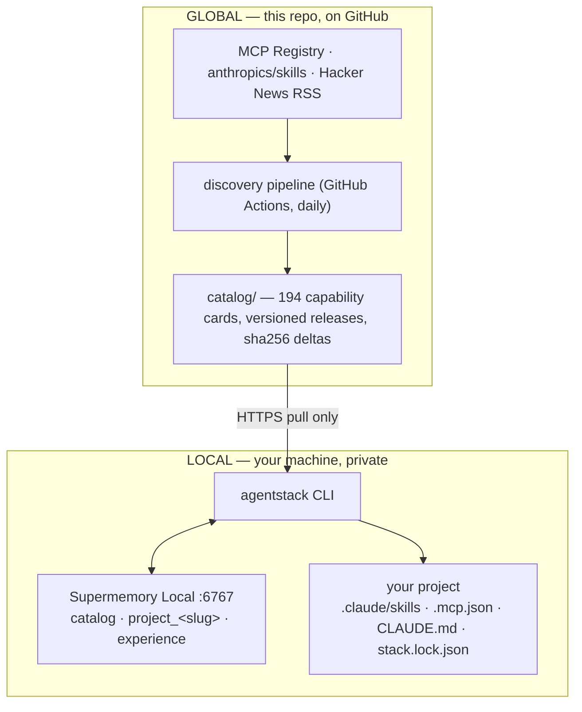

# AgentStack Radar

**A living catalog for AI coding agents — with a memory of what worked for *you*.**

Paste a project idea or point the CLI at a repo. AgentStack Radar matches it against a daily-updated catalog of **MCP servers and Agent Skills**, recommends a minimal explained stack, installs only what you approve — and **remembers every decision and outcome across all your projects**, entirely on your machine, powered by [Supermemory Local](https://supermemory.ai/docs/self-hosting/overview).

> Built solo during the **Localhost:6767 — Supermemory Local Hackathon** (July 2026). Every commit in this repo was written during the build window.

---

## The problem

The AI coding ecosystem ships new MCP servers and Agent Skills **every hour** (we measured ~16 new registry entries per hour while building this). Registries help you *find* tools, but they can't answer the questions that actually matter:

- Which of these fits **my** project, stack, and constraints?
- Which ones violate my privacy requirements? Which are deprecated? Which overlap?
- Which one **failed me last time** — and which one actually helped?

The gap isn't tools. It's a **decision layer** that turns ecosystem noise into a minimal, project-specific, experience-aware stack.

## How it works



**Two halves, one hard privacy boundary:**

1. **A global discovery pipeline** (in this repo, run daily by GitHub Actions) monitors the official MCP Registry, the `anthropics/skills` repository, and a Hacker News feed. An LLM classifies the noise, verifies official sources, extracts structured **Capability Cards**, dedupes them by canonical identity, and publishes **immutable, checksummed catalog releases** as plain JSON — no server, no database, just git.

2. **A local CLI** pulls those releases (zero LLM calls — the expensive analysis happened once, globally) and feeds them into **Supermemory Local**, where public knowledge meets your *private* memory: project profiles, accept/reject decisions with reasons, and end-of-project verdicts. Recommendations are computed locally and explained. Nothing private ever flows up.

### The hero feature: memory that changes the outcome

The differentiator isn't catalog search — it's that **recommendation N+1 is visibly smarter than recommendation 1**:

- In project A, `frontend-design` was the **#1 recommendation** (score 71).
- You told `agentstack feedback` it wasn't useful.
- In project B — a different app, described in different words — it's **gone from the stack**, and the CLI can tell you why.

Two memory paths make this work:

| Path | Mechanism | What it catches |
|---|---|---|
| **1 — deterministic** | exact-capability verdicts in local JSON → direct score adjustments | "this tool failed me" / "this one was great" |
| **2 — semantic** | experience narratives in Supermemory, retrieved by *similarity to the current project* and fed to the LLM ranker | pattern-level lessons — "they've consistently avoided cloud processing", "they hate screen-control tools" — even when worded completely differently |

And every hard *gate* is explained, not hidden: cloud tools are rejected when your project has a privacy constraint, deprecated tools are blocked, already-installed capabilities are never re-recommended.

## The memory model (Supermemory Local)

All memory lives in **Supermemory Local** on `http://localhost:6767` — storage, semantic search, *and embeddings* (a local ONNX model, `bge-base-en-v1.5`) run on your machine.

| containerTag | Contents | Written when |
|---|---|---|
| `catalog` | narrative form of every public capability card | `init` / `update` |
| `project_<slug>` | project profile: goal, stack, constraints, installs | `project init` |
| `experience` | **cross-project** decisions + verdicts, each naming its source project | `apply` (accept/reject + reason) and `feedback` (useful y/n) |

`experience` is deliberately **one user-level container** — lessons must transfer between projects, that's the whole point. Deterministic twins of everything live in `~/.agentstack/` as inspectable JSON (`cat stack.lock.json` beats a database query).

## Quickstart

**Prerequisites:** Node ≥ 22 · [Supermemory Local](https://supermemory.ai/docs/self-hosting/quickstart) running (`npx supermemory local` — on Windows it installs into WSL) · one OpenAI-compatible LLM key (Groq's free tier works great).

### Install from npm (recommended)

```bash
npm install -g agentstack-radar     # or run ad hoc: npx agentstack-radar <command>

export SUPERMEMORY_API_KEY=sm_...   # printed when the supermemory server starts
export AGENTSTACK_LLM_BASE_URL=https://api.groq.com/openai/v1
export AGENTSTACK_LLM_MODEL=llama-3.3-70b-versatile
export AGENTSTACK_LLM_API_KEY=gsk_...

agentstack init            # connect memory, import starter catalog, sync the live catalog
```

### Or run from source

```bash
git clone https://github.com/Yashagarwal9798/Agentstack.git
cd Agentstack
npm install && npm run build
alias agentstack="node $(pwd)/cli/dist/index.js"
agentstack init
```

Then the loop, inside any project directory:

```bash
agentstack project init    # describe the project (+ auto-scan of manifests & existing tools)
agentstack recommend       # minimal explained stack + "Not selected" with reasons
agentstack apply --dry-run # preview every file change and permission risk
agentstack apply           # per-item approval → file writes ONLY, never executes commands
agentstack feedback        # was each capability useful? → memory for next time
```

## Command reference

| Command | What it does |
|---|---|
| `agentstack init` | health checks, LLM provider setup, starter catalog import, optional core skills, first sync |
| `agentstack update` | pull missing catalog releases (checksum-verified deltas) → local mirror + Supermemory; warns if an update affects something you have installed |
| `agentstack discoveries [--since <version>]` | what's new / updated / deprecated |
| `agentstack inspect <id>` | full capability card: permissions, secrets, trust tier, provenance links, where it's installed |
| `agentstack project init` | idea-mode profile + light scan (never re-recommends what you already have) |
| `agentstack recommend` | the two-path ranking engine |
| `agentstack apply [--dry-run] [--reject <id:reason>]` | approval-gated file writes: `.claude/skills/`, `.mcp.json`, `CLAUDE.md`, `AI_STACK.md`, `stack.lock.json` |
| `agentstack feedback [--verdict <id=useful\|not_useful:note>]` | end-of-project review that feeds future rankings |

## Safety model

- **Nothing executes.** `apply` writes text files only. Anything that genuinely requires running a command is printed as a *"run yourself"* checklist with the required secrets and permissions listed.
- **Everything is explained.** Every recommendation shows trust tier, local/cloud behavior, permissions, and provenance URLs; every rejection has a reason.
- **Releases are verifiable.** Catalog deltas carry sha256 checksums; `stack.lock.json` records the exact ids, versions, and catalog release you approved.
- **Unverified sources are never auto-recommended.**

## Repo layout

```
cli/        the agentstack CLI (commands, ranking engine, applier, Claude Code adapter)
pipeline/   the discovery pipeline (source adapters, LLM enrichment, canonical ids, releases)
shared/     zod schemas + LLM client shared by both
catalog/    THE LIVING CATALOG — capability cards, versioned deltas, manifest, pipeline state
starter/    bundled starter catalog + 3 core skills (offline cold start)
scripts/    validation, smoke tests, unit tests, operator tools
docs/       hackathon notes + original product spec
.github/    the daily discovery cron (workflow_dispatch to run it manually)
```

The planning docs are part of the repo's story: [prd.md](prd.md) (what/why), [architecture.md](architecture.md) (how), [phase.md](phase.md) (the build checklist with verification evidence), [context.md](context.md) (the build journal, including a full postmortem of a Supermemory ingest outage we diagnosed with a logging proxy).

## Development

```bash
npm run build              # tsc -b across the workspace
npm run test:recommender   # unit tests for the deterministic ranking stages
npm run validate:starter   # starter cards vs schema
npx tsx scripts/validate-catalog.ts   # full catalog + checksum sweep
npm run pipeline:run       # run the discovery pipeline locally (needs LLM key)
npm run smoke:phase2       # end-to-end memory round-trip (needs Supermemory Local)
```

## How this uses Supermemory Local (hackathon summary)

AgentStack Radar uses Supermemory Local as its entire memory layer: the public capability catalog is stored as semantic narratives in a `catalog` container so projects can find tools *by meaning*; every project gets a private `project_<slug>` container for its profile and constraints; and every accept/reject decision and end-of-project verdict is written to a user-level `experience` container. At recommendation time the CLI searches all three — candidates from `catalog`, context from the project container, and *lessons from past projects* retrieved by similarity from `experience` — so the same question gets a measurably better answer after every project you finish. Storage, search, and embeddings all run locally; the only things that ever leave the machine are pulls of the public catalog JSON and calls to the LLM provider *you* configured.

## Known limitations

- v1 targets **Claude Code** (the adapter interface makes Cursor/Codex a clean add).
- Free-tier LLM rate limits pace the pipeline (batching + retry + requeue handle it; the daily volume is small).
- See [todo.md](todo.md) for the honest deferred-issues list from our pre-ship bug scan.
