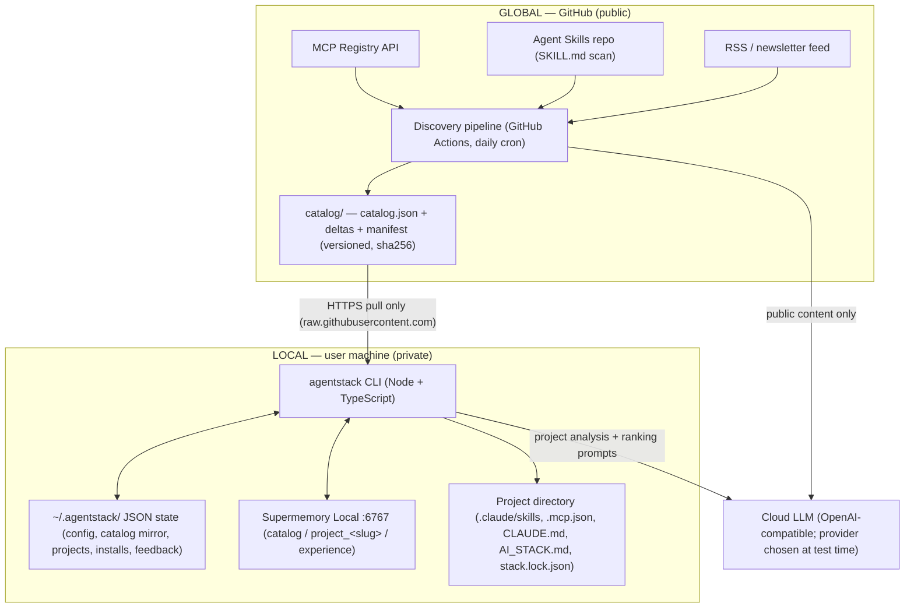
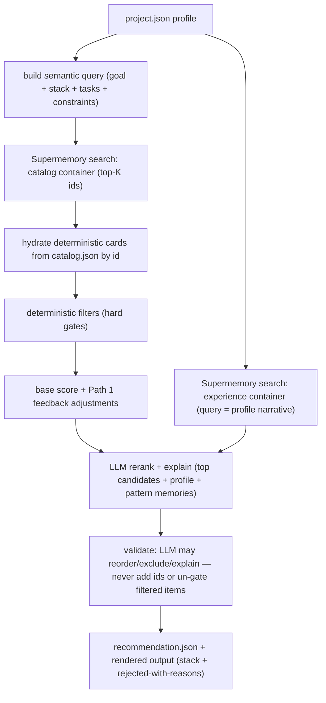

# Architecture — AgentStack Radar

*Companion to [prd.md](prd.md). The PRD says what and why; this document says how. Where they disagree, the PRD wins.*

---

## 1. Overall architecture

Two systems with a hard trust boundary between them. Public knowledge flows down; nothing private flows up.



**Trust boundary rules**

1. The global side processes public ecosystem content only, using the operator's LLM key.
2. The local side *pulls* catalog releases over HTTPS; there is no push channel into the user's machine and no telemetry channel out of it.
3. Private data (project profiles, decisions, feedback) lives only in `~/.agentstack/` JSON and Supermemory Local. The only private data that leaves the machine is what the user's own LLM prompts contain (project analysis/ranking), sent to the provider *they* configured.
4. The CLI talks exclusively to `http://localhost:6767` for memory — never `api.supermemory.ai`.

### 1.1 The dual-storage rule (used everywhere)

Every kind of knowledge has a **deterministic twin** (JSON, exact lookups, versioning, sync state) and a **semantic twin** (Supermemory, meaning-based retrieval). Neither layer does the other's job:

| Knowledge | Deterministic twin (JSON) | Semantic twin (Supermemory) |
|---|---|---|
| Capability catalog | `~/.agentstack/catalog.json` mirror | `catalog` container (narrative cards) |
| Project profile | `<project>/.agentstack/project.json` | `project_<slug>` container |
| Decisions & feedback | `~/.agentstack/feedback.json`, `installs/` | `experience` container |

Deterministic ranking (Path 1) reads JSON. Semantic ranking (Path 2) queries Supermemory. Writes at capture points go to **both** (dual-write).

### 1.2 Monorepo layout

```text
agentstack-radar/
├── cli/                         # the `agentstack` CLI package
│   └── src/
│       ├── commands/            # one file per command (init, update, ...)
│       ├── core/                # services shared by commands
│       │   ├── catalogStore.ts      # local catalog mirror (JSON)
│       │   ├── memory.ts            # Supermemory client wrapper (containers, upsert)
│       │   ├── llm.ts               # provider-agnostic OpenAI-compatible client
│       │   ├── recommender.ts       # filters, scoring, two-path ranking
│       │   ├── profiler.ts          # idea-mode prompts + light repo scan
│       │   ├── applier.ts           # dry-run planner + file-write executor
│       │   ├── stateStore.ts        # ~/.agentstack/ config, projects, installs, feedback
│       │   └── ui.ts                # shared terminal theme: palette, symbols, tables, banners (see CLAUDE.md)
│       └── adapters/
│           └── claudeCode.ts        # AgentAdapter implementation (only one in v1)
├── pipeline/                    # the global discovery pipeline
│   └── src/
│       ├── sources/             # mcpRegistry.ts, skillsRepo.ts, rss.ts
│       ├── classify.ts          # LLM candidate classification
│       ├── verify.ts            # authoritative-source checks
│       ├── extract.ts           # LLM → CapabilityCard (zod + 1 repair retry)
│       ├── canonical.ts         # ID resolution, dedupe, content-hash versioning
│       └── release.ts           # delta + catalog.json + manifest writer
├── shared/                      # zod schemas + types used by both sides
│   └── src/schema.ts            # CapabilityCard, Manifest, Delta, ProjectProfile, ...
├── catalog/                     # PIPELINE OUTPUT, committed by Actions
│   ├── catalog.json             # full current catalog
│   ├── manifest.json            # latest version + release chain + sha256s
│   ├── deltas/<version>.json    # added / updated / deprecated per release
│   └── state/cursors.json       # per-source incremental cursors (no server ⇒ state lives in git)
├── starter/                     # starter catalog JSON + 3 bundled core skills
└── .github/workflows/discover.yml   # cron + workflow_dispatch
```

### 1.3 Local state layout (`~/.agentstack/`)

```text
~/.agentstack/
├── config.json          # provider, model, sm key ref, catalog repo URL, lastSync
├── catalog.json         # deterministic mirror of the global catalog (current versions)
├── releases.json        # applied release history (for `discoveries`)
├── projects.json        # slug → absolute path registry
├── installs/<slug>.json # what was applied where, when, from which release
└── feedback.json        # capabilityId → [{project, verdict, note, date}]  (Path-1 input)
```

Per project (created by `project init` / `apply`):

```text
<project>/
├── .agentstack/project.json   # structured profile (deterministic twin)
├── .agentstack/recommendation.json  # latest recommend output (consumed by apply)
├── .claude/skills/<name>/SKILL.md   # written by apply
├── .mcp.json                        # written by apply
├── CLAUDE.md · AI_STACK.md · stack.lock.json
```

### 1.4 Shared infrastructure components

- **`shared/schema.ts`** — single zod source of truth: `CapabilityCard`, `Manifest`, `Delta`, `ProjectProfile`, `Recommendation`, `StackLock`. Both packages import it; the pipeline validates before publishing, the CLI validates after downloading (defense on both sides of the wire).
- **`core/llm.ts`** — one function surface: `complete(prompt, {json?: zodSchema})`. Reads `baseURL` + `apiKey` + `model` from config/env. JSON mode validates against the zod schema and retries once with the validation errors appended (same repair pattern as the pipeline extractor).
- **`core/memory.ts`** — wraps the Supermemory SDK pinned to `baseURL: http://localhost:6767`. Exposes `upsertCard(card)` (uses `customId = card.id` so re-imports update instead of duplicate), `addProjectMemory(slug, text)`, `addExperience(text)`, `searchCatalog(query)`, `searchExperience(query)`, and `health()` (used by init and as a pre-flight by every command).
- **`adapters/claudeCode.ts`** — implements the `AgentAdapter` interface, the only place agent-specific knowledge lives:

```ts
interface AgentAdapter {
  name: string;                                  // "claude-code"
  skillsDir(projectRoot: string): string;        // .claude/skills/
  instructionFile(projectRoot: string): string;  // CLAUDE.md
  mcpConfigPath(projectRoot: string): string;    // .mcp.json
  renderMcpEntry(card: CapabilityCard): object;  // card.installation.mcpConfig → config fragment
  detectInstalled(projectRoot: string): InstalledCapability[];  // used by the light scan
}
```

---

## 2. Feature architectures

### 2.1 Global discovery pipeline (GitHub Actions)

A stateless batch job; all persistent state (cursors, catalog) lives in the git repo itself, so there is no database and every run is reviewable as a commit.

```text
cron / workflow_dispatch
  │
  ▼
[1] Load catalog/state/cursors.json + catalog/catalog.json
  │
  ▼
[2] Source adapters (independent; one failure never blocks the others)
  │   mcpRegistry: GET /servers?updated_since=<cursor>, paginate
  │   skillsRepo:  compare HEAD SHA vs cursor → list changed SKILL.md dirs
  │   rss:         fetch feed → keep items with GUID/pubDate > cursor
  │   → RawCandidate[] { source, url, title, body, fetchedAt }
  ▼
[3] Classifier (cheap LLM call per candidate, zod-validated)
  │   → { relevant, type, possibleName, officialUrls[], confidence }
  │   confidence ≥ .8 → continue · .5–.8 → hold (logged, not published) · < .5 → drop
  ▼
[4] Verifier (no LLM — HTTP facts)
  │   resolve official repo/registry/docs URL; require install/usage instructions
  │   collect version, license, permissions hints; unverifiable → trust: "unverified"
  ▼
[5] Extractor (LLM → CapabilityCard, schema-constrained)
  │   zod parse; on failure retry ONCE with validation errors as repair context
  │   unknown fields stay unknown (never invented) and lower trust
  ▼
[6] Canonicalizer
  │   id = `${type}:${namespace}/${name}` from registry entry / repo slug
  │   same tool from N sources → 1 card, N sources[] entries
  │   contentHash(card) unchanged → bump lastChecked only
  │   changed → new version of existing card (never a duplicate)
  ▼
[7] Release writer — only if anything changed
  │   write catalog/deltas/<YYYY.MM.DD.N>.json {added, updated, deprecated}
  │   rewrite catalog/catalog.json; append release + sha256 to manifest.json
  │   advance cursors ONLY for sources that fully succeeded
  ▼
[8] git commit + push  → the raw URL of manifest.json IS the release API
```

Idempotency: re-running with unchanged sources produces no new release (hash comparison at step 6); replaying a delta on the CLI side upserts by `id`, so duplicates are structurally impossible.

### 2.2 `agentstack init`

```text
preflight ─ Node version, write access to ~/
  → Supermemory health: GET :6767 reachable? sm_ key valid? (fail → print fix steps: `npx supermemory local`)
  → prompt: LLM provider (baseURL/model/key env name)  [provider undecided → any OpenAI-compatible value works]
  → prompt: coding agent  [v1: claude-code preselected]
  → write ~/.agentstack/config.json (+ empty state files)
  → import starter/ catalog → catalogStore + memory.upsertCard() into `catalog`
  → offer 3 bundled core skills (y/n each) → copy via adapter if accepted
  → run the `update` flow once (§2.3) to reconcile with the live catalog
  → print health summary (this is the folded-in `doctor`)
```

Init is re-runnable: every step is an upsert, nothing is duplicated on a second run.

### 2.3 `agentstack update`

```text
fetch catalog/manifest.json (raw GitHub URL)
  → compare manifest.latestVersion vs config.lastSync.version
  → equal → "up to date", exit
  → build ordered chain of missing deltas from manifest.releases
  → for each delta: download → sha256 verify (mismatch → abort, keep old state)
  → apply in order to ~/.agentstack/catalog.json  (upsert by id; deprecated → status flip)
  → for each added/updated card: memory.upsertCard() → `catalog` container (customId=id ⇒ update-in-place)
  → deprecated: card narrative updated with DEPRECATED prefix (kept for provenance, excluded by filters)
  → append applied releases to releases.json
  → commit config.lastSync ONLY after every step succeeded  (crash ⇒ next run redoes the chain; upserts make that safe)
  → print digest: N new, M updated, K deprecated (+ nudge if any installed capability was deprecated/updated)
```

**Staleness nudge:** every other command compares `lastSync.date` to now; if > 24h it prints one line suggesting `agentstack update`. This replaces any local OS scheduler.

### 2.4 `agentstack discoveries` / `agentstack inspect <id>`

Read-only views over local state — no network, no LLM.

- `discoveries`: reads `releases.json` (default: latest release; `--since <version>` for a range), groups by added / updated / deprecated, one line each with id, type, trust, summary.
- `inspect <id>`: reads the full card from `catalog.json`; renders every field including permissions, install command, `localCloud`, trust tier, and `sources[]` provenance URLs with first-seen/last-checked dates. If the id is installed anywhere (`installs/`), shows where and which version — this is the transparency showcase.

### 2.5 `agentstack project init`

```text
prompts (@clack): goal (free text) · stack (free text) · hard constraints (free text) · stage
  → light scan (automatic when files exist; each probe optional):
      package.json / requirements.txt → declared stack
      README.md (first ~100 lines)    → purpose hints
      adapter.detectInstalled()       → existing .claude/skills/* + .mcp.json entries
  → LLM: prompts + scan evidence → ProjectProfile (zod)
      { slug, goal, stack[], constraints[] (each typed: privacy|platform|budget|other),
        stage, alreadyInstalled[] }
  → show profile to user for confirmation/edit
  → write <project>/.agentstack/project.json  + register in ~/.agentstack/projects.json
  → dual-write narrative → `project_<slug>` container
```

The `alreadyInstalled` list is load-bearing: `recommend` hard-filters those ids so the tool never recommends something the project already has.

### 2.6 `agentstack recommend` — the two-path ranking core



**Stage detail:**

1. **Retrieve (semantic):** `searchCatalog(query)` returns candidate ids by meaning — this is how a huge catalog narrows without keyword matching.
2. **Hydrate (deterministic):** ids → full cards from the local mirror; ranking never trusts narrative text for facts.
3. **Filter (hard gates, each recorded with a reason):** `status ≠ active` · agent incompatible · `trust = unverified` · constraint violations (`localCloud = cloud` vs a privacy constraint) · already installed · overlap (keep best per category). Gated items feed the "Not selected" output — rejections are a feature, not a log.
4. **Score:** PRD §7.3 weights (relevance, compatibility, trust, maintenance, permission fit, install complexity). **Path 1:** `feedback.json` lookups by exact id — "not useful"/failed-install → numeric penalty, "useful" → boost. Pure functions over JSON; fully auditable.
5. **Path 2:** experience memories retrieved by *similarity to the current project* (not by id) — pattern-level lessons ("rejected 3 cloud tools for privacy") that deterministic lookup cannot express.
6. **LLM rerank + explain:** receives top ~10 candidates + profile + pattern memories; returns final minimal stack (target 3–5) with per-item explanations and rejected list. **Constrained:** it may reorder, exclude, and explain — it may never introduce an id that isn't in the candidate list or resurrect a hard-gated item (enforced in code after the call).
7. **Persist:** `recommendation.json` (with catalog release version) — the contract consumed by `apply`.

### 2.7 `agentstack apply [--dry-run]`

```text
load recommendation.json (refuse if catalog release has moved → rerun recommend)
  → PLAN (pure, no side effects): for each recommended item →
      skill: copy starter/catalog source → adapter.skillsDir()/<name>/
      mcp:   merge adapter.renderMcpEntry(card) into .mcp.json
      plus: CLAUDE.md (create or update marked section), AI_STACK.md, stack.lock.json
      plus: "run this yourself" checklist for anything executable (with permissions/secrets listed)
  → --dry-run: render plan (file diffs + risk summaries + checklist) and STOP
  → interactive: per-item approve / reject (reject requires no reason but accepts one)
  → EXECUTE approved file writes only (never runs a command)
  → write stack.lock.json {catalogRelease, capabilities[{id, version, installedAs, approvedAt, source}]}
  → record ~/.agentstack/installs/<slug>.json
  → dual-write EVERY decision → feedback-adjacent local record + `experience` container:
      "Accepted <id> for <project>: <reason/matched constraints>"
      "Rejected <id> for <project>: <user reason>"
```

Plan/execute separation means `--dry-run` and the real run share one code path; the only difference is whether the executor runs. Risky permissions (browser/network/shell/credentials) are highlighted in the plan rendering.

### 2.8 `agentstack feedback`

```text
read stack.lock.json (or installs/<slug>.json) → list every installed capability
  → per item: useful? y/n (+ optional one-line why)
  → dual-write each verdict:
      feedback.json[capabilityId].push({project, verdict, note, date})   ← Path 1 input
      `experience` container: "In project <slug> (<goal>), <id> was (not) useful: <why>"  ← Path 2 input
```

Closing the loop: the next `recommend` in *any* project reads these through both paths — exact-id score shifts and semantically retrieved pattern lessons — which is the product's hero moment.

---

## 3. Cross-cutting concerns

**Error handling.** Every command pre-flights Supermemory health and fails with actionable fix steps rather than stack traces. `update` is transactional-by-ordering: version state commits last, and all writes are upserts so a crashed run is safely re-runnable. Pipeline source adapters fail independently; cursors only advance on success.

**Config precedence.** env vars (`SUPERMEMORY_API_KEY`, `AGENTSTACK_LLM_*`) > `~/.agentstack/config.json`. The LLM provider is exactly three values (baseURL, model, key) — the pending provider decision touches nothing else.

**Security model.** Checksums (sha256 in the manifest) verify catalog integrity; trust tiers gate recommendation eligibility (`unverified` never auto-recommended); `apply` writes files only; executable steps are always a human-run checklist. Cryptographic signing is explicitly out of scope for v1 (PRD §12).

**Privacy invariant (testable).** With the LLM provider stubbed out, the only outbound network request the CLI ever makes is `GET raw.githubusercontent.com/.../catalog/*`. Everything else is `localhost:6767` and the filesystem.

**Windows-first.** No native modules (JSON state, no SQLite); all paths via `path.join`; Supermemory Local on Windows is verified as Phase 0 before any dependent code (fallback: WSL/Docker per hackathon notes).
